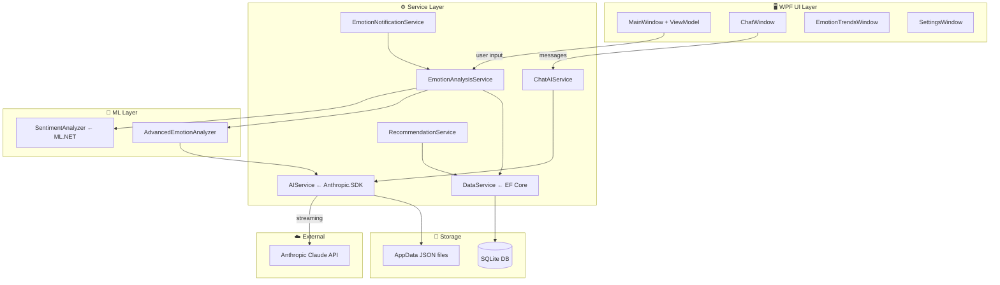

# PersonalAI — ผู้ช่วย AI ส่วนตัว

[](#)
[](#)
[](#)
[](#)
[](#)
[](#)
[](#)
[](#)

แอปพลิเคชัน **WPF Desktop** ที่วิเคราะห์อารมณ์จากข้อความด้วย **ML.NET** และส่งผลไปขอคำแนะนำจาก **Claude API** (Anthropic) พร้อมแสดงการตอบกลับแบบ real-time streaming — ออกแบบมาเพื่อเป็นผู้ช่วยส่วนตัวที่เข้าใจสภาวะอารมณ์ของผู้ใช้

> **Portfolio Edition:** โปรเจกต์นี้ถูก refactor จาก code-behind pattern มาใช้ **MVVM (CommunityToolkit.Mvvm)** และ migrate AI backend จาก LM Studio local model มาใช้ **Claude API** อย่างเป็นทางการ พร้อม streaming response

---

## ✨ ฟีเจอร์หลัก

- **🧠 Emotion Analysis** — วิเคราะห์อารมณ์เชิงลึกจากข้อความด้วย ML.NET + Claude API (อารมณ์หลัก, อารมณ์รอง, ระดับความเครียด, ค่าความเป็นบวก)
- **💬 AI Chat with Streaming** — สนทนากับ Claude แบบ real-time streaming ตัวอักษรไหลทีละตัวเหมือน ChatGPT
- **🎭 AI Personality** — ปรับบุคลิกภาพของ AI ได้ (ชื่อ, เพศ, อายุ, ความเป็นมิตร, อารมณ์ขัน, ความเห็นอกเห็นใจ)
- **📊 Emotion Trends Chart** — กราฟแนวโน้มความเครียดและความเป็นบวกด้วย OxyPlot
- **🎵 Personalized Recommendations** — แนะนำเพลงและเกมที่เหมาะกับอารมณ์ปัจจุบัน
- **🎨 Theme Switcher** — เปลี่ยนธีม Light / Dark / Blue ได้แบบ live
- **🔔 Emotion Notifications** — แจ้งเตือนเมื่อตรวจพบอารมณ์ที่ต้องการความช่วยเหลือ
- **💾 Persistent Storage** — บันทึกประวัติอารมณ์ลง SQLite ผ่าน Entity Framework Core

---

## 🛠️ Tech Stack

| Layer | Technology | หน้าที่ |
| :--- | :--- | :--- |
| **UI Framework** | WPF + XAML (.NET 8.0) | Desktop UI, Window management |
| **Architecture** | MVVM (CommunityToolkit.Mvvm) | ViewModel, RelayCommand, ObservableProperty |
| **AI Backend** | Anthropic Claude API (Anthropic.SDK) | Chat, emotion analysis, recommendations |
| **Local ML** | ML.NET 3.0 | Sentiment pre-screening ก่อนส่งไป Claude |
| **Database** | SQLite + EF Core 8 | เก็บประวัติอารมณ์, preferences, items |
| **Charts** | OxyPlot 2.1.2 | แสดงกราฟแนวโน้มอารมณ์และความเครียด |
| **DI Container** | Microsoft.Extensions.DependencyInjection | Service registration ใน App.xaml.cs |
| **Config** | Microsoft.Extensions.Configuration.Json | โหลด appsettings.json + user settings |

---

## 📊 System Architecture



---

## 📁 โครงสร้างไฟล์

```
PersonalAI/
├── ViewModels/
│   └── MainWindowViewModel.cs       # MVVM ViewModel สำหรับ MainWindow
├── Themes/
│   ├── LightTheme.xaml
│   ├── DarkTheme.xaml
│   └── BlueTheme.xaml
├── AIService.cs                     # Anthropic Claude API client (streaming + non-streaming)
├── AIServiceOptions.cs              # Config: API key, model, endpoint
├── AIPersonality.cs                 # บุคลิกภาพ AI (Singleton, persist ไปยัง JSON)
├── ChatAIService.cs                 # Chat session: proper messages array + history
├── ChatWindow.xaml/.cs              # UI แชทพร้อม streaming response
├── EmotionAnalysisService.cs        # Orchestrator: ML.NET → Claude → SQLite
├── AdvancedEmotionAnalyzer.cs       # วิเคราะห์อารมณ์ 8 ประเภทแบบละเอียด
├── EmotionNotificationService.cs    # ตรวจจับอารมณ์วิกฤตและแจ้งเตือน
├── EmotionTrendsWindow.xaml/.cs     # กราฟ OxyPlot แนวโน้มอารมณ์
├── SentimentAnalyzer.cs             # ML.NET binary classification
├── RecommendationEngine.cs          # Personalized music/game recommendations
├── DataService.cs                   # EF Core repository
├── AppDbContext.cs                  # SQLite schema (EmotionEntries, MusicGameItems)
├── ThemeManager.cs                  # Live theme switching
├── SecurityHelper.cs                # Content safety check
├── MainWindow.xaml/.cs              # Main UI (binds to ViewModel)
├── App.xaml.cs                      # DI container setup
├── appsettings.json                 # Config: Anthropic API key, model name
└── PersonalAI.csproj
```

---

## 🚀 วิธีติดตั้งและรัน

### ข้อกำหนด

- Windows 10/11
- .NET 8.0 SDK
- Anthropic API Key (รับได้ที่ [console.anthropic.com](https://console.anthropic.com))

### ขั้นตอน

```bash
# 1. Clone repository
git clone https://github.com/kyosuke11z/PersonalAI.git
cd PersonalAI

# 2. ตั้งค่า API Key ใน appsettings.json
# แก้ไข "AnthropicApiKey": "your-api-key-here"

# 3. Build และรัน
dotnet run
```

### ตั้งค่า appsettings.json

```json
{
  "AIService": {
    "Provider": "Anthropic",
    "AnthropicApiKey": "sk-ant-...",
    "ModelName": "claude-sonnet-4-6",
    "MaxTokens": 1024,
    "Temperature": 0.7
  }
}
```

---

## 🎯 Key Engineering Decisions

**MVVM ด้วย CommunityToolkit.Mvvm** — ใช้ source generator (`[ObservableProperty]`, `[RelayCommand]`) แทน boilerplate `INotifyPropertyChanged` ทำให้ ViewModel กระชับและ testable ขึ้น

**Claude API แทน LM Studio** — migrate จาก raw `HttpClient` + local model ไปใช้ `Anthropic.SDK` อย่างเป็นทางการ ได้ proper messages array, system prompt แยก, และ streaming via `IAsyncEnumerable`

**Streaming response** — `ChatWindow` รับ `IAsyncEnumerable<string>` จาก `AIService.StreamResponseAsync()` และ append ทีละ chunk ลง `ChatDisplayMessage.Content` ผ่าน Dispatcher ทำให้ตัวอักษรไหล real-time

**ML.NET pre-screening** — ก่อนส่งข้อความไป Claude จะผ่าน `SentimentAnalyzer` (binary classification) ก่อนเพื่อใส่ hint ให้ Claude วิเคราะห์อารมณ์ได้แม่นยำขึ้น

**Proper messages array** — `ChatAIService` เดิมสร้าง prompt เป็น string ยาว (anti-pattern) ตอนนี้ใช้ `List<Message>` จริงๆ โดยแยก system prompt ออกจาก conversation history ตาม Anthropic API spec

**DI ผ่าน Microsoft.Extensions.DI** — ทุก service ลงทะเบียนใน `App.xaml.cs` ไม่มี `new` ตรงๆ ใน code-behind ยกเว้น sub-window ที่ใช้ `AddTransient`

---

## 📝 License

MIT License
